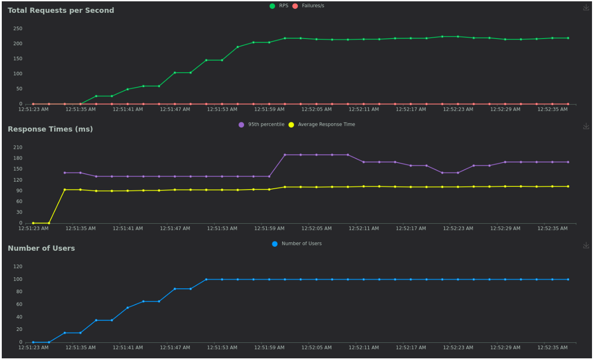

# НИЯУ МИФИ. Лабораторная работа №1. Мясниов Руслан, Б21-525. 2024

## Описание системы

Сервис для инвесторов. Пользователь создает портфель и прикрепляет к нему токены своих кошельков. Он может отправить запрос на обновленние данных, перейдя в
статус Process. Запрос попадает в очередь. После его обработки (получения ответа с серверов брокеров), в зависимости от результата статуи меняется на Success или Error.
Для получения данных из базы данных предусмотрен GET запрос.

Ожидаемая нагрузка на систему: 100 - 500 RPS

### Используемые технологии

- Go
- SQLite
- RabbitMQ
- Python

В качестве брокера был выбран RabbitMQ из-за гибкости в обработки сообщений, простоты, надёжности.

## Запуск и тестирование системы

1. Запуск контейнера:
   ```bash
   cd deploy
   docker-compose up
   ```
2. Запуск сервера (Да, сервер запускается не в виртуальной среде из-за "Since Docker is a US company, we must comply with US export control regulations." А на танцы с бубном уже времени не было):
   ```bash
   go run cmd/main/app.go
   go run cmd/consumer/consumer.go
   ```
3. Запук тестирования:
   ```bash
   locust -H http://127.0.0.1:1234
   ```

## Нагрузочное тестирование

### без прогрева



### с прогревом


На данных графиках видно, что в отличии от тестирования без прогрева эндпоинт с кешированием отвечает примерно на 45 мс быстрее, чем эндпоинт без кэширования. Это обусловлено более высокой скоростью кэша по сравнению с базой данных.

## Заключение

В ходе проведенной лабораторной работы была интегрирована система кэширования и прогрева. Были проведены тесты работы системы с прогревом и без, в результате который система с прогревом показала значительно лучшие результаты по сравнению с системой без прогрева.
